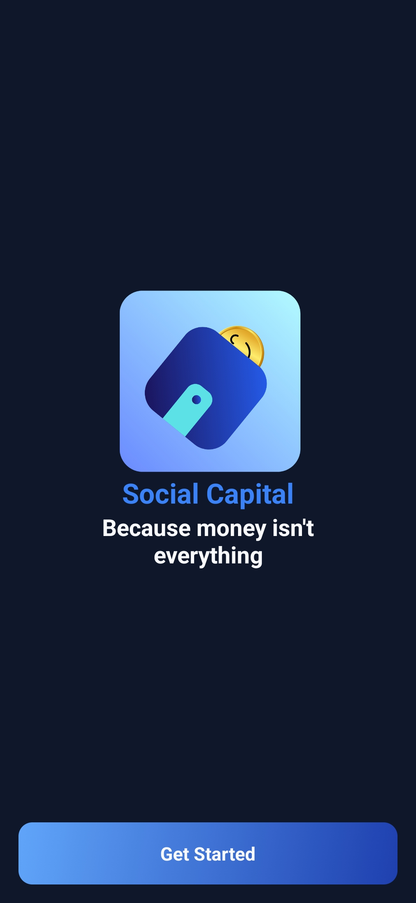
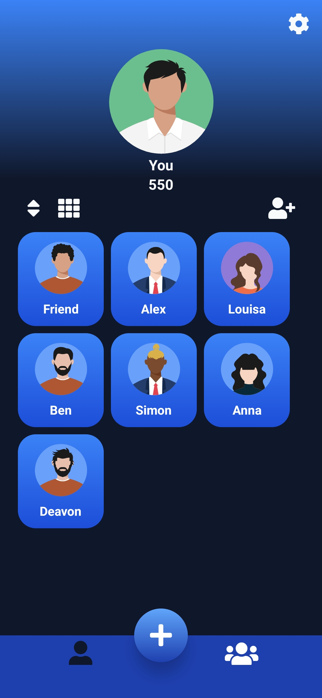
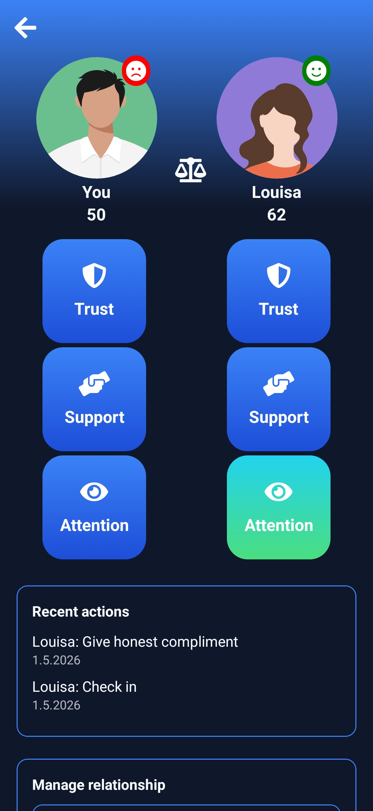
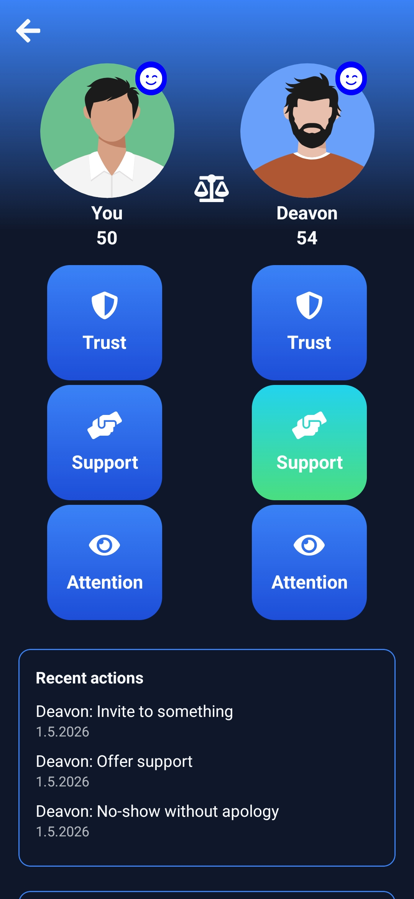
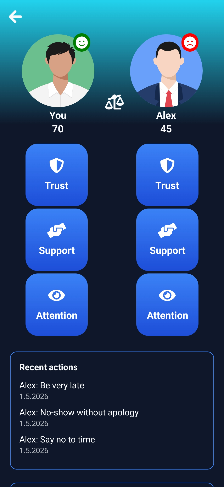
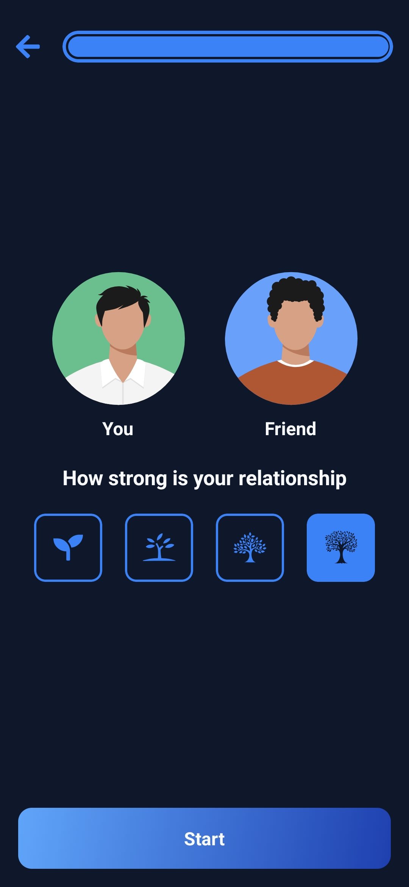
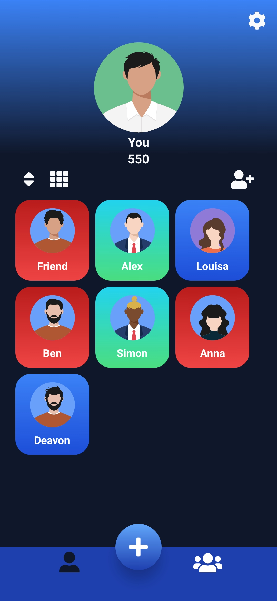
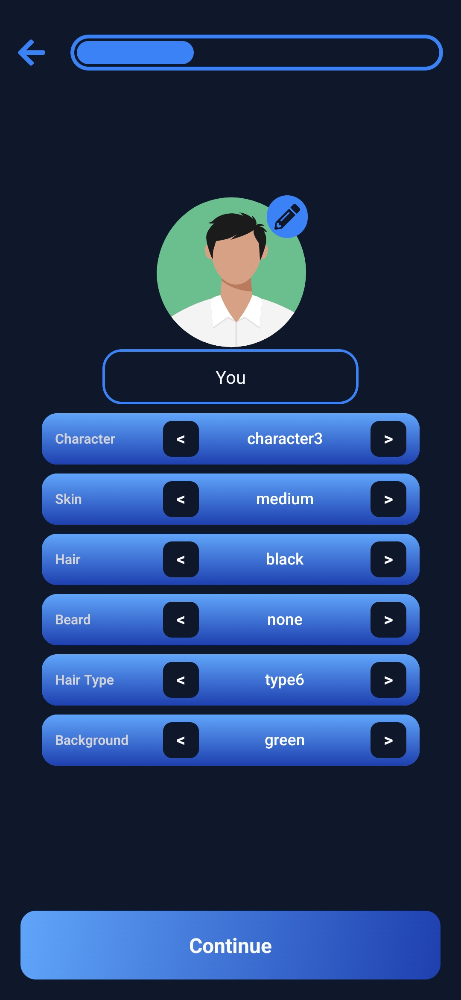
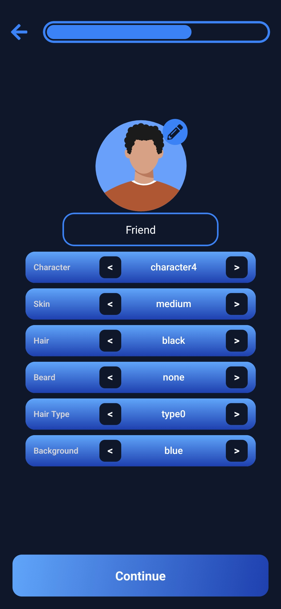

# SocialCapital

SocialCapital is a React Native/Expo app for reflecting on everyday relationships.
It helps you make relationships visible, track actions, and develop a better balance between giving and receiving.

## Main Features

- Onboarding flows for new users (e.g. "About Us" and "Getting Started").
- Personal avatar and profile area.
- Create, edit, and manage relationships.
- Daily Entry with timer logic for "you" and "them" including action selection.
- Points and balance logic for each relationship.
- Badge / Ink Badge system for motivation.
- Statistics and overview components (streak, points, history).
- Multi-language support via i18n (DE, EN, ES, FRA).
- Rewarded Ads integration.

## Tech Stack

- Expo + React Native
- TypeScript
- Expo Router (file-based routing)
- NativeWind / Tailwind for styling
- i18next / react-i18next for localization
- EAS Build for store and release builds

## Project Structure (Overview)

- `app/`: Screens and routing structure
- `components/`: Reusable UI components
- `context/`: Global state (`GlobalProvider`)
- `functions/`: Business logic (scoring, daily entry, stats)
- `constants/`: Theme, types, static configuration
- `assets/`: Images, localization files, and other resources

## Screenshots and App Structure

The following sequence shows the typical user flow through the app, illustrating how the main areas are built.

### 1) Onboarding

The entry point explains the purpose of the app and guides users through the first steps.



### 2) Relationships Overview

A glance at all your added relationships.



### 3) Relationship View (per person)

The detail view shows the status of individual relationships from your perspective.





### 4) Relationship Strength and Balance

Visualization of the relationship dynamic and the current give/receive balance.



### 5) Progress After First Entries

How the overview changes once you start logging Daily Entries.



### 6) Avatar and Profile Editing

You can customize both your own avatar and the avatar of any relationship.




### Architecture in One Line

Onboarding → Overview → Relationship Details → Daily Entry / Balance → Avatar Customization

## Setup and Development

### Prerequisites

- Node.js (LTS recommended)
- npm
- Expo CLI (optional, alternatively via `npx expo`)
- Android Studio / Xcode (depending on target platform)

### Installation

```bash
npm install
```

### Start the Development Server

```bash
npm run start
```

Optional targets:

```bash
npm run android
npm run ios
npm run web
```

## Bundling and Builds

There are two common ways to bundle the app and produce release artifacts.

### 1) EAS Build (recommended)

The configuration lives in `eas.json` with the profiles `development`, `preview`, and `production`.

Android APK for internal testing:

```bash
eas build --platform android --profile preview
```

Android App Bundle (AAB) for the Play Store:

```bash
eas build --platform android --profile production
```

iOS release build:

```bash
eas build --platform ios --profile production
```

Important:

- Log in to Expo before the first build: `eas login`
- Set environment variables in EAS/CI as needed (e.g. `EXPO_PUBLIC_API_URL`)

### 2) Local Android Bundling (Gradle)

Since an `android/` folder is present, you can also build an AAB locally:

```bash
cd android
./gradlew bundleRelease
```

Windows PowerShell:

```powershell
cd android
.\gradlew.bat bundleRelease
```

The output is typically located at:

```text
android/app/build/outputs/bundle/release/
```

## Code Quality

Run linting:

```bash
npm run lint
```

## Notes

- Routing is handled by Expo Router using the file structure in `app/`.
- Localization files are located under `assets/images/languages/locales/`.
- App behavior and scoring are tightly coupled to the global context and the functions in `functions/`.
